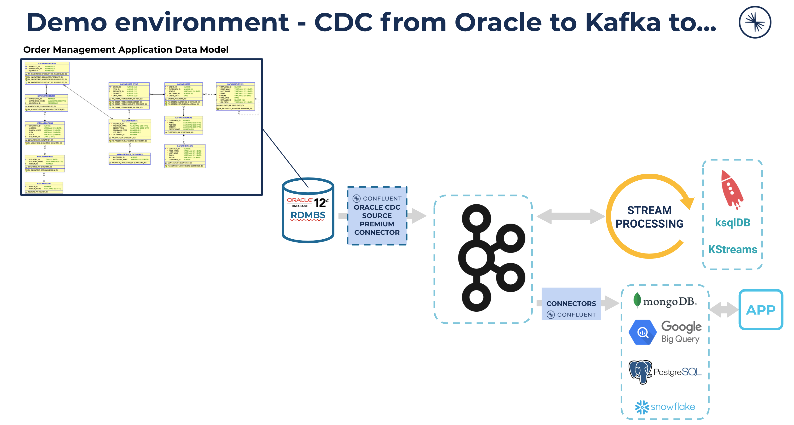
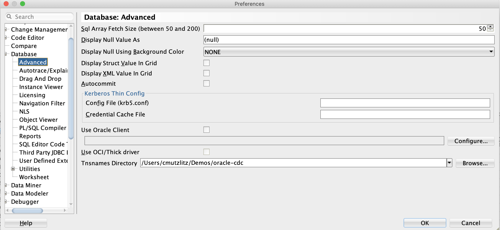
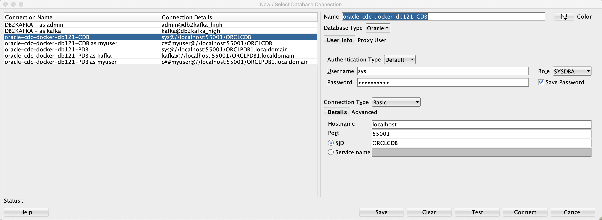
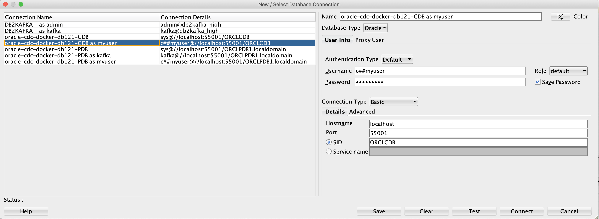
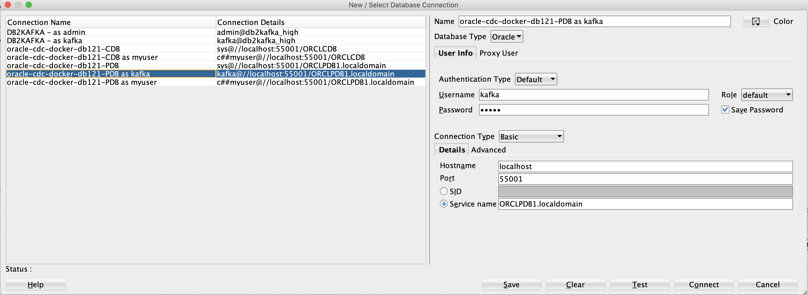
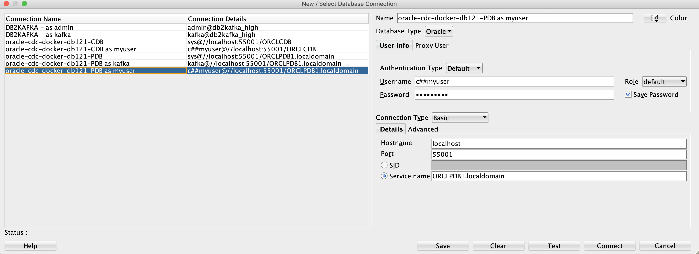

# Confluent Platform/Apache Kafka CDC Connector for Oracle databases

Change Data Capturing from Oracle Database (in this project Ora-DB Version 12.2) is the focus. We will capture all event from our order management application stored in Oracle Database in real-time into Confluent PlatformApache Kafka. From there you can do so much new stuff which incredible.


My test environment is a MacBook Pro with MacOs Catalina.
To execute the demo we need a couple of things to be installed:
- docker. See [docu](https://docs.docker.com/docker-for-mac/install/)
- jq 
- JDK 8 or 11
- Confluent Platform 6.1 [Download from here](https://www.confluent.io/download/#confluent-platform)
- Confluent cli tool, see [installation hints](https://docs.confluent.io/confluent-cli/current/installing.html)
- Confluent Hub client, see [installation hints](https://docs.confluent.io/home/connect/confluent-hub/client.html)
- get Oracle Db 12.2 Docker image (installation hints later)

more Tools to install. 
I did use both Oracle Tools, but one would be enough for the Demo:
- Oracle SQL*Plus as instant client (installation hints later)
- Oracle SQLDeveloper (installation hints later)

## Demo cloning
Choose a working directory on your mac and clone this repositoy `git clone https://github.com/ora0600/confluent-oracle-cdc-connector-demo.git`

## Get Oracle Database 12.2.0.1.0 up and running
We are working with an Oracle Docker Image. We use Oracle's docker hub image for a 12.2 database.
```bash
# login to docker hub
docker login
# if you run this command the first time, you will download the image
docker run -d -it --name oradb121 -P store/oracle/database-enterprise:12.2.0.1
# the -P enabled a public port
# Please check the Port, in my case it was 55001, if it different please change the following setup from 55001 to the new value.
docker port oradb121
# Check container running
docker ps
```
Now, check a little bit the database. We have one CDB and one PDB.
```bash
# log-in to container, later we talk directly with Oracle DB via the Port 55001, this trail is only to check how DB is setup
docker exec -it oradb121 bash 
cat /home/oracle/.bashrc
source /home/oracle/.bashrc
cd /u01/app/oracle/product/12.2.0/dbhome_1/admin/ORCLCDB
cat listener.ora
lsnrctl status
sqlplus /nolog
sql> connect sys/Oradoc_db1 as sysdba
sql> select dbid, con_id, name from v$pdbs;
sql> select dbid, con_id, name from v$pdbs;
sql> alter session set container = CDB$ROOT;
sql> select dbid, con_id, name from v$pdbs;
sql> select sys_context('USERENV','CON_NAME') CON_NAME,
            sys_context('USERENV','CON_ID') CON_ID,
            sys_context('USERENV','DB_NAME') DB_NAME from DUAL;
sql> exit
exit
```

### Setup tnsnames.ora
We are back on our Mac. And here you should configure TNSNAMES as well. This is necessary to talk to the Oracle Database.
The TNS should already there (from the git clone). Please check if we have the correct Ports:
```bash
cat tnsnames.ora
ORCLCDB =   (DESCRIPTION =     (ADDRESS = (PROTOCOL = TCP)(HOST = 0.0.0.0)(PORT = 55001))     (CONNECT_DATA =       (SERVER = DEDICATED)       (SERVICE_NAME = ORCLCDB.localdomain)     )   )
ORCLPDB1 =   (DESCRIPTION =     (ADDRESS = (PROTOCOL = TCP)(HOST = 0.0.0.0)(PORT = 55001))     (CONNECT_DATA =       (SERVER = DEDICATED)       (SERVICE_NAME = ORCLPDB1.localdomain)     )   )
# ALSO check what's in sqlnet.ora, we do both connection types ezconnect and tnsnames later
cat sqlnet.ora
NAMES.DIRECTORY_PATH=(ezconnect, tnsnames)
```
Now, we have to organize that our Oracle Net will be find tnsnames.ora. So, please set the environment variable to enable finding our `tnsnames.ora`.
```bash
export TNS_ADMIN=<your PATH>/confluent-oracle-cdc-connector-demo
```

### Install SQL*Plus instant client
Install Sql*Plus 12.2 instant client from [here](https://www.oracle.com/database/technologies/instant-client/macos-intel-x86-downloads.html)
download 12.2 basic package and download sqlplus package 12.2
Then prepare your system
```bash
# add a local repo to 
brew tap InstantClientTap/instantclient
# move zip to 
mv ~/Downloads/instantclient-basic-macos.x64-12.2.0.1.0-2.zip /usr/local/Homebrew/Library/Taps/instantclienttap/homebrew-instantclient/
mv ~/Downloads/instantclient-sqlplus-macos.x64-12.2.0.1.0-2.zip /usr/local/Homebrew/Library/Taps/instantclienttap/homebrew-instantclient/
brew install instantclient-basic
brew install instantclient-sqlplus
export PATH=$PATH:/usr/local/Cellar/instantclient-sqlplus/19.8.0.0.0dbru/bin/
```
### Configure the database with SQL*Plus
Please follow the steps to configure DB for our Demo:
```bash
# open sqlplus as Super-Admin sysdba, we connect via tnsnames.ora
sqlplus sys/Oradoc_db1@ORCLCDB as sysdba
sql> exit
# try ezconnect 
sqlplus /nolog
sql> CONNECT sys/Oradoc_db1@localhost:55001/ORCLCDB.localdomain as sysdba
# connect as sysdba and see what's there
sql> connect sys/Oradoc_db1@ORCLCDB as sysdba
sql> select dbid, con_id, name from v$pdbs;
sql> select dbid, con_id, name from v$pdbs;
sql> alter session set container = CDB$ROOT;
sql> select dbid, con_id, name from v$pdbs;
sql> select sys_context('USERENV','CON_NAME') CON_NAME,
            sys_context('USERENV','CON_ID') CON_ID,
            sys_context('USERENV','DB_NAME') DB_NAME from DUAL;
sql> exit
# Now prepare DB and install a sample data model into the ordermgtm user
sqlplus sys/Oradoc_db1@ORCLPDB1 as sysdba
sql> @scripts/01_create_user.sql
sql> connect ordermgmt/kafka@ORCLPDB1
sql> @scripts/02_create_schema_datamodel.sql
sql> @scripts/04_load_data.sql
sql> select * from cat;
sql> exit
# Register Oracle CDC privs in DB
sqlplus sys/Oradoc_db1@ORCLCDB as sysdba
sql> @05_cdc_privs.sql
# check if archiv log is on (it's not)
sql> ARCHIVE LOG LIST; 
# if archive mode is "no archive mode" switch it on
sql> exit;
docker exec -it oradb121 bash 
source /home/oracle/.bashrc
sqlplus sys/Oradoc_db1 as sysdba
sql> SHUTDOWN IMMEDIATE;
SQL> STARTUP MOUNT;
SQL> ALTER DATABASE ARCHIVELOG;
SQL> ALTER DATABASE OPEN;
# Set logging all columns if a row is updated in CDB is optional
sql> ALTER SESSION SET CONTAINER=cdb$root;
sql> ALTER DATABASE ADD SUPPLEMENTAL LOG DATA (ALL) COLUMNS;
# Set logging all columns if a row is updated in PDB is a must
sql> ALTER SESSION SET CONTAINER=orclpdb1;
sql> ALTER DATABASE ADD SUPPLEMENTAL LOG DATA (ALL) COLUMNS;
# check if Flashback is enabled
sql> SELECT FLASHBACK_ON FROM V$DATABASE; 
sql> exit;
exit;
```
Database is now prepared. Data is loaded and DB is configured to be able to work with the Confluent Oracle CDC Connector.

### Install Oracle SQLDeveloper
Install SQLDeveloper from [here](https://www.oracle.com/tools/downloads/sqldev-downloads.html)
SQL_Developer have to know our tnsnames.ora setup, please configure
 * set preferences->database->advanced->tnsnames directory to <your-path>/confluent-oracle-cdc-connector-demo


I added all Connections, so it easier for you to play around with the different users
Setup SQLDeveloper Connection to connect CDB as sysdba

Setup SQLDeveloper Connection to connect CDB as C##myuser or we call it C##CDCCONNECT

Setup SQLDeveloper Connection to connect PDB as sysdba

Setup SQLDeveloper Connection to connect PDB as kafka or we use ordermgmt in our demo:

Setup SQLDeveloper Connection to connect PDB as C##myuser or we call it C##CDCCONNECT:


## Install the Confluent Hub Client
Install the hub client by following these [instructions](https://docs.confluent.io/home/connect/confluent-hub/client.html).
The Confluent HUB Client is using to install connectors very easily.
```bash
brew tap confluentinc/homebrew-confluent-hub-client
brew install --cask confluent-hub-client
# check if hubclient can be executed
confluent-hub
```

## Install the Confluent CDC Connector for Oracle
Please be aware that Confluent Platform is already installed.
How to install the connector, please follow [this](https://www.confluent.io/hub/confluentinc/kafka-connect-oracle-cdc).
```bash
confluent-hub install confluentinc/kafka-connect-oracle-cdc:1.0.3
# I answered the following way
choosed 1
answered with "n" choosed in my case $CONFLUENT_HOME/share/java
answered with "y"
answered with "y"
```
# Now run the different scenarios we are covering with Confluent Oracle CDC Connector

## CAPTURING REDO LOGS ONLY
```bash
# Start local Confluent Platform 6.1
confluent local services start
# scenario redo logs only: Capturing Redo logs only
# Start connector
curl -s -X POST -H 'Content-Type: application/json' --data @config1.json http://localhost:8083/connectors | jq
# or
confluent local services connect connector load SimpleOracleCDC_1 -c ~/Demos/oracle-cdc/config1.json
# get status
curl -s -X GET -H 'Content-Type: application/json' http://localhost:8083/connectors/SimpleOracleCDC_1/status | jq
confluent local services connect connector status SimpleOracleCDC_1
# connector Deletion is you want this, maybe you have an error
curl -X DELETE http://localhost:8083/connectors/SimpleOracleCDC_1
confluent local services connect connector unload SimpleOracleCDC_1

# add new customer into database
sqlplus ordermgmt/kafka@ORCLPDB1
SQL> insert into ordermgmt.CUSTOMERS (CUSTOMER_ID,NAME,ADDRESS,CREDIT_LIMIT,WEBSITE) values (501,'Confluent1','Mountain View',5000,'http://www.confluent.io');
sql> commit;
sql> exit;
## The connector produces records whenever DML events (INSERT, UPDATE, AND DELETE) occur for captured tables.
## use C3 to monitor new record or use consumer
kafka-avro-console-consumer --topic redo-log-topic-1 \
--partition 0 --offset earliest --bootstrap-server localhost:9092 \
--property schema.registry.url=http://localhost:8081
## check column in redo-log-topics 1:
"SQL_REDO": {
    "string": "insert into \"KAFKA\".\"CUSTOMERS\"(\"CUSTOMER_ID\",\"NAME\",\"ADDRESS\",\"WEBSITE\",\"CREDIT_LIMIT\") values ('500','Confluent','Mountain View','http://www.confluent.io','5000');"
  },
  "SQL_UNDO": {
    "string": "delete from \"KAFKA\".\"CUSTOMERS\" where \"CUSTOMER_ID\" = '500' and \"NAME\" = 'Confluent' and \"ADDRESS\" = 'Mountain View' and \"WEBSITE\" = 'http://www.confluent.io' and \"CREDIT_LIMIT\" = '5000' and ROWID = 'AAAS2TAAUAAAADzAA2';"
  },
# new topic redo-log-topic was created
kafka-topics --list --bootstrap-server localhost:9092

# check errors
confluent local services connect log | grep "ERROR"

# stop confluent and destroy
confluent local services stop
confluent local destroy
```
## Capturing Redo logs and Change Event logs
```bash
confluent local services start
# create topic
kafka-topics --create --topic redo-log-topic-2 \
--bootstrap-server localhost:9092 --replication-factor 1 \
--partitions 1 --config cleanup.policy=delete \
--config retention.ms=120960000
# start connector
curl -s -X POST -H 'Content-Type: application/json' --data @config2.json http://localhost:8083/connectors | jq
#get status
curl -s -X GET -H 'Content-Type: application/json' http://localhost:8083/connectors/SimpleOracleCDC_2/status | jq
confluent local services connect connector status SimpleOracleCDC_2
# add new customer
sqlplus ordermgmt/kafka@ORCLPDB1
SQL> insert into ordermgmt.CUSTOMERS (CUSTOMER_ID,NAME,ADDRESS,CREDIT_LIMIT,WEBSITE) values (502,'Confluent2','Mountain View',5000,'http://www.confluent.io');
sql> commit;
sql> exit;
# check redo log topic
kafka-avro-console-consumer --topic redo-log-topic-2 \
--partition 0 --offset earliest --bootstrap-server localhost:9092 \
--property schema.registry.url=http://localhost:8081
# check table topics
kafka-avro-console-consumer --topic ORCLPDB1.ORDERMGMT.CUSTOMERS \
--partition 0 --offset earliest --bootstrap-server localhost:9092 \
--property schema.registry.url=http://localhost:8081
# do uopdate and delete and stuff like that
toDo
# stop confluent and destroy
confluent local services stop
confluent local destroy
```

## Starting from a specific SCN (without snapshot)
```bash
confluent local services start
# create topic
kafka-topics --create --topic redo-log-topic-3 \
--bootstrap-server localhost:9092 --replication-factor 1 \
--partitions 1 --config cleanup.policy=delete \
--config retention.ms=120960000
# get current SCN
sqlplus sys/Oradoc_db1@ORCLPDB1 as sysdba
SQL> SELECT CURRENT_SCN FROM v$database;
sql> exit;
# add SCN into config3.json under start.from
vi config3.json
"start.from": "new SCN"
# save config3.json

# start conector 
curl -s -X POST -H 'Content-Type: application/json' --data @config3.json http://localhost:8083/connectors | jq
# status
curl -s -X GET -H 'Content-Type: application/json' http://localhost:8083/connectors/SimpleOracleCDC_3/status | jq
# add new customer
sqlplus ordermgmt/kafka@ORCLPDB1
SQL> insert into ordermgmt.CUSTOMERS (CUSTOMER_ID,NAME,ADDRESS,CREDIT_LIMIT,WEBSITE) values (503,'Confluent3','Mountain View',5000,'http://www.confluent.io');
sql> insert into ordermgmt.CUSTOMERS (CUSTOMER_ID,NAME,ADDRESS,CREDIT_LIMIT,WEBSITE) values (504,'Confluent4','Mountain View',5000,'http://www.confluent.io');
sql> commit;
sql> exit;
# check redo log topic
kafka-avro-console-consumer --topic redo-log-topic-3 \
--partition 0 --offset earliest --bootstrap-server localhost:9092 \
--property schema.registry.url=http://localhost:8081
# check table topics
kafka-avro-console-consumer --topic ORCLPDB1.ORDERMGMT.CUSTOMERS \
--partition 0 --offset earliest --bootstrap-server localhost:9092 \
--property schema.registry.url=http://localhost:8081

# stop confluent and destroy
confluent local services stop
confluent local destroy
```
## Capturing LOB type columns, Table notes column note is CLOB
```bash
confluent local services start
# create topic
kafka-topics --create --topic redo-log-topic-4 \
--bootstrap-server localhost:9092 --replication-factor 1 \
--partitions 1 --config cleanup.policy=delete \
--config retention.ms=120960000

# start connector
curl -s -X POST -H 'Content-Type: application/json' --data @config4.json http://localhost:8083/connectors | jq
# check status
curl -s -X GET -H 'Content-Type: application/json' http://localhost:8083/connectors/SimpleOracleCDC_4/status | jq
# add new note
sqlplus ordermgmt/kafka@ORCLPDB1
SQL> insert into ordermgmt.NOTES(NOTE_ID,NOTE) values (11,'This is really a very long note. And we have to organize that is stored as CLOB in the database, and we see what is happening in Kafka with this column');
sql> commit;
sql> exit;
```
Check in C3 what was happening after our INSERT Statement.
* the insert is documented into redo-log-topic-4
* a new topic NOTES.NOTE_topic was created for LOB Column
   * Here the lob column is stored
      * Key: { "table": "ORCLPDB1.ORDERMGMT.NOTES", "column": "NOTE", "primary_key": "\u000b" }
      * Value: This is really a very long note. And we have to organize that is stored as CLOB in the database, and we see what is happening in Kafka ...
* a new Topic ORCLPDB1.ORDERMGMT.NOTES was created where all changes are documented
   * Here the columns are stored without NOTE CLOB column 
```bash
# stop confluent and destroy
confluent local services stop
confluent local destroy
```

# finally stop the DB container
```bash
# stop
docker stop oradb121
docker rm oradb121
```

# License
Confluent Oracle CDC Connector is premium connector and need to be subscribed. Anyway for testing a 30 day evaluation license is always included.
The COnfluent Platform with one Node ( 1 broker, 1 ZK) is currently (Feb 2021) under Developer License and free of charge. 
To be really license compliance please contact confluent.io and ask.
